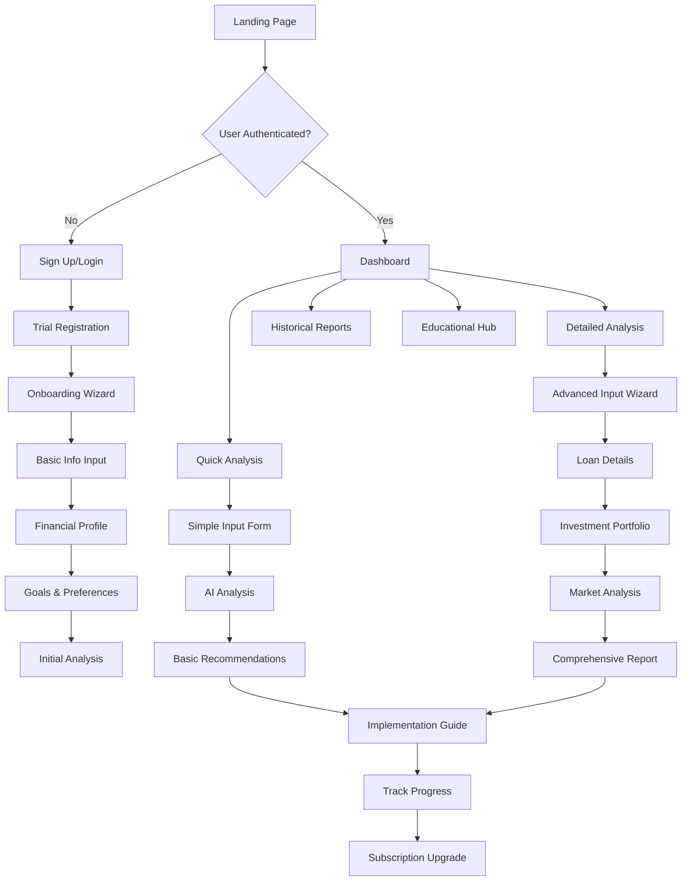

# UCW Financial Predictor - Frontend Design & Implementation Specification

## Table of Contents
1. [Application Overview](#application-overview)
2. [UI/UX Design System](#uiux-design-system)
3. [Wireframes & User Flows](#wireframes--user-flows)
4. [Component Architecture](#component-architecture)
5. [State Management Strategy](#state-management-strategy)
6. [Accessibility Compliance](#accessibility-compliance)
7. [Performance Optimization](#performance-optimization)
8. [Cross-Browser Testing Matrix](#cross-browser-testing-matrix)
9. [API Integration](#api-integration)
10. [Implementation Timeline](#implementation-timeline)

---

## Application Overview

### Purpose
AI-powered financial advisory tool for UCW students to make informed decisions about loan repayment vs. investment strategies.

### Target Audience
- Primary: UCW students (18-35 years old)
- Secondary: Young professionals with student loans
- Varying financial literacy levels

### Core Features
- Progressive disclosure input wizard with AI-powered recommendations
- Interactive financial projections and scenario comparisons
- Educational content with guided explanations
- Freemium subscription model with trial tracking
- Mobile-first responsive design

### Technology Stack
- **Framework**: Next.js 14+ with TypeScript
- **Styling**: Tailwind CSS with custom design system
- **State Management**: Zustand for global state
- **Data Fetching**: TanStack Query (React Query)
- **Charts**: Recharts for financial visualizations
- **Forms**: React Hook Form with Zod validation
- **UI Components**: Custom component library with Headless UI
- **Icons**: Lucide React
- **Animations**: Framer Motion

---

## UI/UX Design System

### Color Palette

```css
/* Primary Colors - Financial Trust & Growth */
:root {
  --primary-blue: #1e40af;        /* Main CTA buttons, primary actions */
  --primary-blue-light: #3b82f6;  /* Hover states, secondary elements */
  --primary-blue-dark: #1e3a8a;   /* Active states, emphasis */

  /* Secondary Colors - Success & Growth */
  --success-green: #059669;       /* Positive trends, profits */
  --success-green-light: #10b981; /* Success states, confirmations */
  --warning-amber: #d97706;       /* Warnings, important notices */
  --error-red: #dc2626;           /* Errors, losses, critical alerts */

  /* Neutral Colors - Clean & Professional */
  --gray-900: #111827;            /* Primary text, headers */
  --gray-700: #374151;            /* Secondary text, labels */
  --gray-500: #6b7280;            /* Tertiary text, placeholders */
  --gray-300: #d1d5db;            /* Borders, dividers */
  --gray-100: #f3f4f6;            /* Background, cards */
  --gray-50: #f9fafb;             /* Page background */
  --white: #ffffff;               /* Card backgrounds, inputs */

  /* Accent Colors - Data Visualization */
  --chart-blue: #3b82f6;
  --chart-green: #10b981;
  --chart-purple: #8b5cf6;
  --chart-orange: #f59e0b;
  --chart-pink: #ec4899;
}
```

### Typography System

```css
/* Font Families */
--font-primary: 'Inter', -apple-system, BlinkMacSystemFont, sans-serif;
--font-mono: 'JetBrains Mono', 'Fira Code', monospace;

/* Font Scale */
--text-xs: 0.75rem;     /* 12px - Small labels, captions */
--text-sm: 0.875rem;    /* 14px - Body text, form inputs */
--text-base: 1rem;      /* 16px - Default body text */
--text-lg: 1.125rem;    /* 18px - Large body text */
--text-xl: 1.25rem;     /* 20px - Small headings */
--text-2xl: 1.5rem;     /* 24px - Section headers */
--text-3xl: 1.875rem;   /* 30px - Page titles */
--text-4xl: 2.25rem;    /* 36px - Hero headings */
--text-5xl: 3rem;       /* 48px - Display headings */

/* Font Weights */
--font-light: 300;
--font-normal: 400;
--font-medium: 500;
--font-semibold: 600;
--font-bold: 700;
```

### Spacing System (8px Grid)

```css
--space-1: 0.25rem;   /* 4px */
--space-2: 0.5rem;    /* 8px */
--space-3: 0.75rem;   /* 12px */
--space-4: 1rem;      /* 16px */
--space-6: 1.5rem;    /* 24px */
--space-8: 2rem;      /* 32px */
--space-12: 3rem;     /* 48px */
--space-16: 4rem;     /* 64px */
--space-20: 5rem;     /* 80px */
```

### Component Specifications

```css
/* Border Radius */
--radius-sm: 0.25rem;   /* 4px - Small elements */
--radius-md: 0.375rem;  /* 6px - Buttons, inputs */
--radius-lg: 0.5rem;    /* 8px - Cards, modals */
--radius-xl: 0.75rem;   /* 12px - Large containers */

/* Shadows */
--shadow-sm: 0 1px 2px 0 rgb(0 0 0 / 0.05);
--shadow-md: 0 4px 6px -1px rgb(0 0 0 / 0.1);
--shadow-lg: 0 10px 15px -3px rgb(0 0 0 / 0.1);
--shadow-xl: 0 20px 25px -5px rgb(0 0 0 / 0.1);

/* Transitions */
--transition-fast: 150ms ease-in-out;
--transition-normal: 300ms ease-in-out;
--transition-slow: 500ms ease-in-out;
```

---

## Wireframes & User Flows

### User Flow Diagram



### Key Pages & Components

#### 1. Landing Page
- Hero section with value proposition
- Interactive financial calculator preview
- Feature highlights
- Social proof and testimonials
- Pricing tiers
- Call-to-action for trial signup

#### 2. Dashboard
- Welcome message with trial status
- Quick stats cards (Net Worth, Debt Load, ROI)
- Recent analyses carousel
- Quick action buttons
- Market pulse widget
- Next recommended actions

#### 3. Analysis Input Wizard
- Progress indicator (5 steps)
- Step 1: Basic Information
- Step 2: Financial Profile
- Step 3: Loan Details
- Step 4: Investment Profile
- Step 5: Goals & Preferences

#### 4. Analysis Results
- AI recommendation summary
- Confidence score indicator
- Scenario comparison charts
- Detailed financial projections
- Implementation plan
- Export/share functionality

#### 5. Educational Hub
- Financial literacy articles
- Interactive tutorials
- Glossary of terms
- Video explanations
- Progress tracking

---

## Component Architecture

### Project Structure

```
apps/web/src/
├── components/
│   ├── ui/                    # Reusable UI components
│   │   ├── Button.tsx
│   │   ├── Input.tsx
│   │   ├── Card.tsx
│   │   ├── Modal.tsx
│   │   ├── Tooltip.tsx
│   │   ├── Chart.tsx
│   │   ├── Badge.tsx
│   │   ├── Progress.tsx
│   │   └── index.ts
│   ├── layout/               # Layout components
│   │   ├── Header.tsx
│   │   ├── Sidebar.tsx
│   │   ├── Footer.tsx
│   │   ├── Navigation.tsx
│   │   └── AppLayout.tsx
│   ├── auth/                 # Authentication components
│   │   ├── LoginForm.tsx
│   │   ├── SignUpForm.tsx
│   │   ├── ProtectedRoute.tsx
│   │   └── AuthProvider.tsx
│   ├── dashboard/            # Dashboard components
│   │   ├── DashboardStats.tsx
│   │   ├── RecentAnalyses.tsx
│   │   ├── QuickActions.tsx
│   │   ├── MarketPulse.tsx
│   │   └── TrialStatus.tsx
│   ├── analysis/             # Analysis components
│   │   ├── wizard/
│   │   │   ├── WizardLayout.tsx
│   │   │   ├── BasicInfo.tsx
│   │   │   ├── FinancialProfile.tsx
│   │   │   ├── LoanDetails.tsx
│   │   │   ├── InvestmentProfile.tsx
│   │   │   └── GoalsPreferences.tsx
│   │   ├── results/
│   │   │   ├── RecommendationSummary.tsx
│   │   │   ├── ScenarioComparison.tsx
│   │   │   ├── DetailedAnalysis.tsx
│   │   │   └── ImplementationPlan.tsx
│   │   └── AnalysisHistory.tsx
│   ├── charts/               # Chart components
│   │   ├── ComparisonChart.tsx
│   │   ├── ProjectionChart.tsx
│   │   ├── AllocationChart.tsx
│   │   ├── TrendChart.tsx
│   │   └── ChartTooltip.tsx
│   └── landing/              # Landing page components
│       ├── Hero.tsx
│       ├── Features.tsx
│       ├── Testimonials.tsx
│       ├── Pricing.tsx
│       └── CallToAction.tsx
├── pages/                    # Next.js pages
│   ├── index.tsx             # Landing page
│   ├── dashboard.tsx         # Dashboard
│   ├── analysis/
│   │   ├── new.tsx           # Analysis wizard
│   │   └── [id].tsx          # Analysis results
│   ├── auth/
│   │   ├── login.tsx
│   │   └── signup.tsx
│   └── _app.tsx
├── hooks/                    # Custom React hooks
│   ├── useAuth.ts
│   ├── useAnalysis.ts
│   ├── useMarketData.ts
│   ├── useLocalStorage.ts
│   └── useDebounce.ts
├── stores/                   # State management (Zustand)
│   ├── authStore.ts
│   ├── analysisStore.ts
│   ├── userPreferencesStore.ts
│   └── marketDataStore.ts
├── services/                 # API services
│   ├── api.ts
│   ├── authService.ts
│   ├── analysisService.ts
│   └── marketService.ts
├── types/                    # TypeScript definitions
│   ├── auth.ts
│   ├── analysis.ts
│   ├── market.ts
│   └── common.ts
├── utils/                    # Utility functions
│   ├── formatters.ts
│   ├── validators.ts
│   ├── calculations.ts
│   └── constants.ts
└── styles/                   # Global styles
    ├── globals.css
    └── components.css
```

---

## State Management Strategy

### Zustand Store Structure

```typescript
// stores/authStore.ts
interface AuthState {
  user: User | null;
  token: string | null;
  isAuthenticated: boolean;
  subscriptionStatus: SubscriptionStatus;
  trialDaysLeft: number;
  isLoading: boolean;
  
  // Actions
  login: (credentials: LoginCredentials) => Promise<void>;
  logout: () => void;
  refreshToken: () => Promise<void>;
  updateProfile: (data: Partial<User>) => Promise<void>;
  checkTrialStatus: () => Promise<void>;
}

// stores/analysisStore.ts
interface AnalysisState {
  currentAnalysis: AnalysisData | null;
  analyses: AnalysisData[];
  isLoading: boolean;
  error: string | null;
  
  // Wizard state
  wizardStep: number;
  wizardData: Partial<AnalysisInput>;
  isWizardComplete: boolean;
  
  // Actions
  setWizardStep: (step: number) => void;
  updateWizardData: (data: Partial<AnalysisInput>) => void;
  submitAnalysis: (data: AnalysisInput) => Promise<void>;
  fetchAnalyses: () => Promise<void>;
  clearWizardData: () => void;
}

// stores/marketDataStore.ts
interface MarketDataState {
  rates: MarketRates | null;
  indices: MarketIndices | null;
  lastUpdated: Date | null;
  isLoading: boolean;
  
  // Actions
  fetchMarketData: () => Promise<void>;
  refreshData: () => Promise<void>;
}
```

---

## Accessibility Compliance (WCAG 2.1 AA)

### Implementation Checklist

**Color & Contrast**
- ✅ Minimum contrast ratio 4.5:1 for normal text
- ✅ Minimum contrast ratio 3:1 for large text  
- ✅ Color not used as sole means of conveying information
- ✅ Focus indicators clearly visible with 2px outline

**Keyboard Navigation**
- ✅ All interactive elements keyboard accessible
- ✅ Logical tab order maintained
- ✅ Skip links for main content
- ✅ Escape key closes modals/dropdowns
- ✅ Arrow keys for chart navigation

**Screen Reader Support**
- ✅ Semantic HTML elements used correctly
- ✅ ARIA labels for complex interactions
- ✅ Image alt text provided
- ✅ Form labels properly associated
- ✅ Live regions for dynamic content updates

**Content & Structure**
- ✅ Headings follow hierarchical structure (h1 → h2 → h3)
- ✅ Form validation messages clearly associated
- ✅ Error messages descriptive and actionable
- ✅ Loading states announced to screen readers

---

## Performance Optimization

### Code Splitting Strategy
```typescript
// Route-based code splitting
const Dashboard = lazy(() => import('../pages/Dashboard'));
const AnalysisWizard = lazy(() => import('../components/analysis/wizard/WizardLayout'));
const DetailedChart = lazy(() => import('../components/charts/DetailedChart'));

// Component-based splitting for heavy features
const AdvancedAnalysis = lazy(() => import('../components/analysis/AdvancedAnalysis'));
```

### Data Fetching Optimization
```typescript
// React Query configuration
const queryClient = new QueryClient({
  defaultOptions: {
    queries: {
      staleTime: 5 * 60 * 1000, // 5 minutes
      cacheTime: 10 * 60 * 1000, // 10 minutes
      refetchOnWindowFocus: false,
      retry: 2
    }
  }
});

// Prefetch critical data
const usePreloadDashboard = () => {
  const queryClient = useQueryClient();
  
  useEffect(() => {
    queryClient.prefetchQuery(['analyses'], () => fetchAnalyses());
    queryClient.prefetchQuery(['marketData'], () => fetchMarketData());
  }, []);
};
```

### Image & Asset Optimization
- Next.js Image component with lazy loading
- WebP format with fallbacks
- Responsive image sizing
- Icon sprite sheets for common icons
- Font subsetting for custom fonts

### Bundle Optimization
- Tree shaking for unused code
- Webpack bundle analyzer integration
- Gzip compression
- Critical CSS inlining
- Service worker for caching

---

## Cross-Browser Testing Matrix

| Browser | Desktop Version | Mobile Version | Priority | Features |
|---------|----------------|----------------|----------|----------|
| Chrome | 90+ | 90+ | High | Full feature support |
| Firefox | 88+ | 88+ | High | Full feature support |
| Safari | 14+ | 14+ | High | Charts may need polyfills |
| Edge | 90+ | 90+ | Medium | Full feature support |
| Samsung Internet | - | 14+ | Medium | Basic feature support |
| Opera | 76+ | - | Low | Basic feature support |

### Testing Strategy
- **Automated Testing**: Playwright for E2E tests across browsers
- **Visual Testing**: Percy for visual regression testing
- **Performance Testing**: Lighthouse CI in build pipeline
- **Accessibility Testing**: axe-core integration with jest-axe
- **Mobile Testing**: BrowserStack for real device testing

---

## API Integration

### API Client Structure
```typescript
// services/api.ts
class ApiClient {
  private baseURL = process.env.NEXT_PUBLIC_API_URL;
  private instance = axios.create({
    baseURL: this.baseURL,
    timeout: 10000,
    headers: {
      'Content-Type': 'application/json',
    },
  });

  constructor() {
    this.setupInterceptors();
  }

  private setupInterceptors() {
    // Request interceptor for auth token
    this.instance.interceptors.request.use((config) => {
      const token = useAuthStore.getState().token;
      if (token) {
        config.headers.Authorization = `Bearer ${token}`;
      }
      return config;
    });

    // Response interceptor for token refresh
    this.instance.interceptors.response.use(
      (response) => response,
      async (error) => {
        if (error.response?.status === 401) {
          await useAuthStore.getState().refreshToken();
          return this.instance.request(error.config);
        }
        return Promise.reject(error);
      }
    );
  }
}
```

### Error Handling Strategy
- Global error boundary for React component errors
- API error handling with user-friendly messages
- Network error detection and retry logic
- Form validation with real-time feedback
- Loading states for all async operations

---

## Implementation Timeline

### Phase 1: Foundation (Week 1-2)
- ✅ Set up Next.js project with TypeScript
- ✅ Configure Tailwind CSS with custom design system
- ✅ Create base UI component library
- ✅ Set up state management with Zustand
- ✅ Configure React Query for data fetching

### Phase 2: Core Pages (Week 3-4)
- 🔄 Landing page with hero and features
- 🔄 Authentication pages (login/signup)
- 🔄 Dashboard with basic widgets
- 🔄 Navigation and layout components

### Phase 3: Analysis Features (Week 5-6)
- 📋 Analysis input wizard
- 📋 Results display with charts
- 📋 Scenario comparison
- 📋 Implementation plan generation

### Phase 4: Advanced Features (Week 7-8)
- 📋 Educational content section
- 📋 Historical analysis tracking
- 📋 Subscription management
- 📋 Export and sharing functionality

### Phase 5: Polish & Optimization (Week 9-10)
- 📋 Performance optimization
- 📋 Accessibility audit and fixes
- 📋 Cross-browser testing
- 📋 Mobile responsiveness refinement
- 📋 Analytics integration

---

## Key Success Metrics

### Technical Metrics
- **Performance**: Lighthouse score >90
- **Accessibility**: 100% WCAG 2.1 AA compliance
- **Browser Support**: 95%+ of target browsers
- **Mobile Performance**: <3s load time on 3G

### User Experience Metrics
- **Conversion Rate**: 15% trial-to-paid conversion
- **User Engagement**: 80% return within 30 days
- **Task Completion**: 90% analysis completion rate
- **User Satisfaction**: 4.5+ star rating

### Business Metrics
- **Revenue Growth**: 20% month-over-month growth
- **Customer Acquisition Cost**: <$50 per user
- **Lifetime Value**: >$200 per user
- **Churn Rate**: <5% monthly churn

---

*Document Version: 1.0*  
*Last Updated: January 2025*  
*Next Review: February 2025*