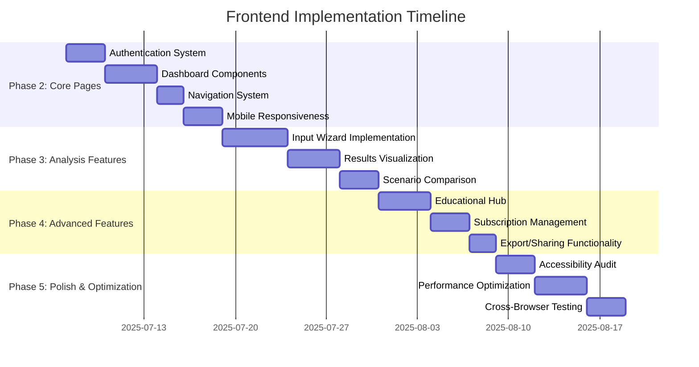

# UCW Financial Predictor - Frontend Implementation Roadmap

## Current Implementation Status (July 2025)

### Phase Completion:
- **Phase 1: Foundation**: 100% ✅  
- **Phase 2: Core Pages**: 40% 🔄  
- **Phase 3: Analysis Features**: 0% 📋  
- **Phase 4: Advanced Features**: 0% 📋  
- **Phase 5: Polish & Optimization**: 0% 📋  

### Key Implemented Components:
- Landing page framework
- UI Button component
- Basic layout structure
- Color palette and typography system

### Critical Gaps:
1. Authentication system (login/signup)
2. Dashboard functionality
3. Analysis input wizard
4. Results visualization
5. State management integration
6. API connection
7. Accessibility compliance

---

## Implementation Phases & Timeline

---

## Component Implementation Priority

### High Priority (Weeks 1-2)
1. **Authentication System**
   - LoginForm.tsx
   - SignUpForm.tsx
   - ProtectedRoute.tsx
   - AuthProvider.tsx

2. **Dashboard Components**
   - DashboardStats.tsx
   - RecentAnalyses.tsx
   - QuickActions.tsx
   - MarketPulse.tsx

3. **Core UI Components**
   - Input.tsx
   - Card.tsx
   - Modal.tsx
   - Progress.tsx

### Medium Priority (Weeks 3-4)
1. **Analysis Wizard**
   - WizardLayout.tsx
   - FinancialProfile.tsx
   - LoanDetails.tsx
   - GoalsPreferences.tsx

2. **Visualization Components**
   - ComparisonChart.tsx
   - ProjectionChart.tsx
   - AllocationChart.tsx

3. **State Management**
   - authStore.ts
   - analysisStore.ts
   - userPreferencesStore.ts

### Low Priority (Weeks 5-6)
1. EducationalHub.tsx
2. SubscriptionManagement.tsx
3. ExportFunctionality.tsx

---

## Risk Mitigation Strategies

| Risk Category | Mitigation Strategy | Owner |
|---------------|---------------------|-------|
| Component Complexity | Implement atomic design pattern with Storybook documentation | Frontend Lead |
| State Management | Version stores with migration paths | Tech Lead |
| Performance | Lazy loading for charts, code splitting | Performance Engineer |
| Accessibility | Integrate axe-core, manual screen reader testing | QA Lead |
| Browser Compatibility | BrowserStack automation, progressive enhancement | QA Engineer |

---

## Success Metrics

### Technical Metrics
| Metric | Target | Measurement Tool |
|--------|--------|------------------|
| Lighthouse Score | >90 | Lighthouse CI |
| WCAG Compliance | 100% AA | axe-core |
| Load Time (3G) | <3s | WebPageTest |
| API Error Rate | <1% | DataDog |

### User Metrics
| Metric | Target | Measurement Tool |
|--------|--------|------------------|
| Trial Conversion | >15% | Mixpanel |
| User Retention (30d) | >80% | Amplitude |
| Analysis Completion | >90% | FullStory |
| CSAT Score | >4.5/5 | SurveyMonkey |

---

## Next Steps
1. Review and finalize this roadmap with stakeholders
2. Break down epics into user stories
3. Set up CI/CD pipeline for frontend
4. Begin implementation in priority order

*Document Version: 1.0*  
*Created: July 6, 2025*  
*Owner: Frontend Engineering Team*